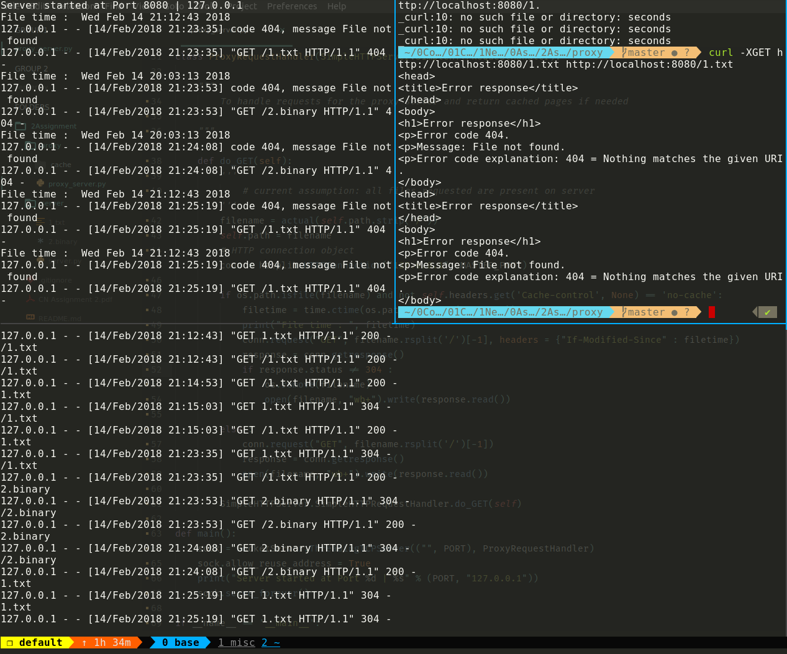

# CN Assignment - Proxy Server

Simple Proxy server using python2 sockets and SimpleHTTPServer

## Introduction

This is a basic implementation of a proxy server with `python2` and `sockets`.
This proxy server does cache management as well taking into account the modified
times and refreshing the cache accordingly. Binary files are obviously not
cached.

## How to run

- For the proxy server:

```

./proxy_server <proxy_port> <master_port>*

```

- For the master server

```

./server.py <master_port>

```

These ports are options and default to _12345_ for the proxy server and _20000_
for the main server. The project is done under assumption that the the file is
present on the server.


## Results


